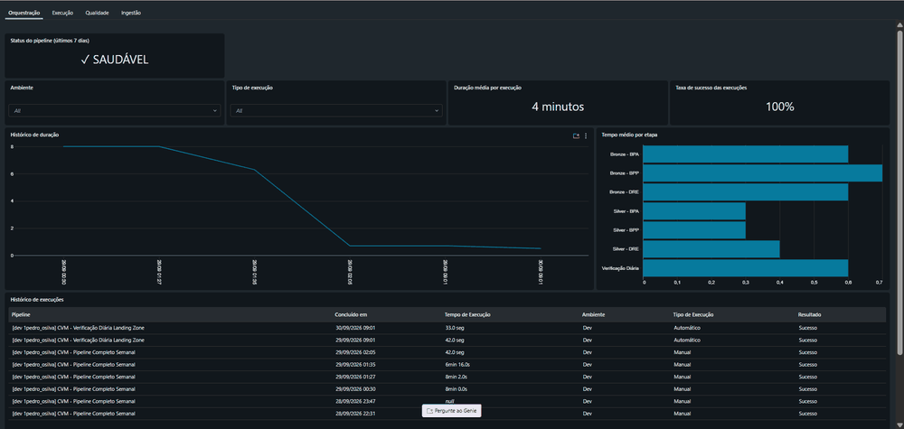

[](https://github.com/1pedroosilva/projeto-cvm-dados-financeiros/actions/workflows/ci.yml)
[](https://github.com/1pedroosilva/projeto-cvm-dados-financeiros/actions/workflows/testes_integracao.yml)
[](https://github.com/1pedroosilva/projeto-cvm-dados-financeiros/actions/workflows/codeql.yml)

# Projeto CVM - Dados Financeiros

Pipeline de ingestão e transformação de demonstrações financeiras de companhias abertas brasileiras, publicadas pela Comissão de Valores Mobiliários (CVM). Arquitetura medalhão implementada em Databricks com Delta Lake e Unity Catalog — Bronze e Silver em produção, Gold planejada.

> **📋 [Estado Atual do Projeto](00_documentacao/tecnica/estado_atual.md)** — Retrato de hoje: jobs ativos, notebooks em produção, utilitários e aposentados (sem histórico).

## O que é este projeto

Processa demonstrações financeiras padronizadas (DFP) da CVM:
* **DRE** (Demonstração do Resultado do Exercício) - receitas, despesas e resultado
* **BPA** (Balanço Patrimonial Ativo) - ativos
* **BPP** (Balanço Patrimonial Passivo) - passivos e patrimônio líquido

Os dados são extraídos do [Portal de Dados Abertos da CVM](https://dados.cvm.gov.br/), processados em camadas (bronze → silver) e armazenados em Unity Catalog para análise.

## Arquitetura

### Camadas de Dados

```
[CVM Portal] → [Landing Zone] → [Bronze] → [Silver] → [Gold (planejada)]
     ZIP          UC Volume      Raw Data   Curated    KPIs
```

**Bronze** (`01_bronze/`): Preservação dos dados brutos da fonte
* 3 notebooks: `101_cvm_dfp_dre`, `102_cvm_dfp_bpa`, `103_cvm_dfp_bpp`
* Tabelas: `{SCHEMA_BRONZE}.101_dre_dfp`, `102_bpa_dfp`, `103_bpp_dfp` (via config_parametros)
* Estratégia: APPEND-ONLY (histórico completo, idempotente)
* Guardrails: arquivo vazio, schema inválido

**Silver** (`02_silver/`): Dados limpos, tipados e enriquecidos
* 3 notebooks: `201_cvm_dfp_dre`, `202_cvm_dfp_bpa`, `203_cvm_dfp_bpp`
* Tabelas: `{SCHEMA_SILVER}.201_dre_dfp`, `202_bpa_dfp`, `203_bpp_dfp` (via config_parametros)
* Transformações: conversão de tipos, normalização de escala monetária, filtro de duplicatas, colunas derivadas (ANO, TRIMESTRE, MES)
* Estratégia: REPLACE WHERE (substituição atômica por período)
* Guardrails: bronze vazia para o ano

**Gold** (`03_gold/`): Planejada (métricas e KPIs) — não implementada

**Landing Zone**: `VOLUME_LANDING_DFP` (config_parametros) - preservação de arquivos originais ZIP com metadados HTTP

### Estrutura do Repositório

```
projeto-cvm-dados-financeiros/
├── .github/
│   ├── dependabot.yml                              # Atualizações de dependências (semanal)
│   └── workflows/
│       ├── ci.yml                                  # Ruff + pytest (push/PR no main)
│       ├── codeql.yml                              # Code scanning Python (push/PR + semanal)
│       └── testes_integracao.yml                   # Deploy + run testes E2E (manual)
├── 00_documentacao/
│   ├── evolucao_projeto.md                         # Histórico e decisões
│   ├── negocio/
│   │   └── dicionario_dados.md                     # Conceitos de negócio CVM/DFP
│   └── tecnica/
│       ├── arquitetura.md                          # Especificação técnica completa
│       ├── estado_atual.md                         # Retrato do pipeline hoje
│       ├── guardrails.md                           # Validações de qualidade
│       └── refatoracao_observabilidade.md          # Design da refatoração da observabilidade
├── 01_bronze/
│   ├── 101_cvm_dfp_dre.py                          # DRE consolidada → bronze
│   ├── 102_cvm_dfp_bpa.py                          # BPA consolidado → bronze
│   └── 103_cvm_dfp_bpp.py                          # BPP consolidado → bronze
├── 02_silver/
│   ├── 201_cvm_dfp_dre.py                          # Bronze DRE → silver (limpo, tipado)
│   ├── 202_cvm_dfp_bpa.py                          # Bronze BPA → silver (limpo, tipado)
│   └── 203_cvm_dfp_bpp.py                          # Bronze BPP → silver (limpo, tipado)
├── 03_gold/
│   └── README.md                                   # Descrição da camada planejada
├── 04_exploracao/
│   ├── EDA_001_analise_dre_silver.ipynb            # EDA DRE silver
│   ├── EDA_002_analise_bpa_silver.py               # EDA BPA silver
│   └── EDA_003_analise_bpp_silver.py               # EDA BPP silver
├── 05_apoio/
│   ├── 001_ddl_create_tables.py                    # Criação de schemas e tabelas UC
│   ├── 004_verificacao_diaria_landing.py           # Verificação da landing zone
│   ├── 005_transposicao_system.ipynb               # Transposição system.lakeflow → UC
│   ├── 099_ddl_table_comments.py                   # Comentários UC nas tabelas
│   ├── ambientes.json                              # Resolução de ambiente e carga
│   ├── config_parametros.py                        # Configuração central do pipeline
│   └── transformacoes_silver.py                    # Funções de transformação silver
├── 06_testes/
│   ├── test_integracao_bpa.py                      # Validação E2E BPA Bronze→Silver
│   ├── test_integracao_bpp.py                      # Validação E2E BPP Bronze→Silver
│   └── test_integracao_dre.py                      # Validação E2E DRE Bronze→Silver
├── assets/
│   └── painel_obs_cvm.gif                          # GIF do painel de observabilidade
├── resources/
│   ├── dashboards/
│   │   ├── dashboard_observabilidade.yml           # Definição DAB do dashboard
│   │   ├── painel_observabilidade.lvdash.json      # Dashboard Lakeview serializado
│   │   └── painel_observabilidade.lvdash.json.tpl  # Template do dashboard
│   └── jobs/
│       ├── job_pipeline_semanal.yml                # Bronze→Silver semanal (6 tasks)
│       ├── job_testes_integracao.yml               # Testes E2E
│       └── job_verificacao_diaria.yml              # Verificação diária landing zone
├── scripts/
│   └── gen_dashboard.py                            # Gerador de dashboard por ambiente
├── tests/
│   ├── test_config_parametros.py                   # Testes unitários config_parametros
│   ├── test_inicializar_anos.py                    # Testes unitários inicializar_anos
│   ├── test_novos_anos.py                          # Testes unitários novos_anos
│   ├── test_schema_validation.py                   # Testes unitários validação de schema
│   └── test_transformacoes_silver.py               # Testes unitários transformações silver
├── .gitignore                                      # Exclusões do Git
├── databricks.yml                                  # Configuração DAB
├── LICENSE                                         # MIT
├── README.md                                       # Este arquivo
├── requirements-test.txt                           # Dependências de teste
└── ruff.toml                                       # Configuração do linter
```

## Stack Tecnológico

* **Plataforma**: Databricks (Serverless Compute)
* **Armazenamento**: Delta Lake + Unity Catalog
* **Processamento**: Apache Spark (PySpark)
* **Orquestração**: Databricks Workflows (Databricks Asset Bundles)
* **Governança**: Unity Catalog (schemas, volumes, controle de ingestão)

## Configuração

### Databricks Asset Bundle (DAB)

O projeto usa DAB para gerenciar infraestrutura como código. 3 ambientes declarados em `ambientes.json`:

**dev** (padrão, instanciado):
* Catálogo: `workspace`
* Prefixo de schema: `proj_cvm_dev`
* Landing Zone: `/Volumes/workspace/proj_cvm/landing`

**test** (instanciado):
* Catálogo: `workspace`
* Prefixo de schema: `proj_cvm_test`

**prod** (declarado, não instanciado):
* Catálogo: `workspace`
* Prefixo de schema: `proj_cvm_prod`

Configuração em `databricks.yml` e `resources/jobs/*.yml`.

## Execução

### Via Databricks Workflows (Recomendado)

O job `pipeline_semanal` orquestra Bronze→Silver para DRE, BPA e BPP em três trilhos paralelos (6 tasks). Orquestração e download não são tasks deste job — o download é feito pelo job `verificacao_diaria`.

**Jobs**:

* `pipeline_semanal` — Bronze→Silver, semanal às segundas 07:00 (América/São_Paulo). Ativo no target dev; pausado no target test
* `verificacao_diaria` — Verificação da landing zone, diário às 06:00 (América/São_Paulo). Ativo no target dev; pausado no target test
* `transposicao_system` — Transposição diária de `system.lakeflow` para tabelas UC (`observabilidade_runs`, `observabilidade_tasks`), às 07:00 (América/São_Paulo). Ativo no target dev; pausado no target test

O target test existe para o job `testes_integracao_cvm` (executado sob demanda via GitHub Actions). Os jobs `pipeline_semanal` e `verificacao_diaria` são deployados no target test mas ficam pausados — não há execução automática agendada em test.

**Deploy via DAB**:
```bash
# Validar configuração
databricks bundle validate -t dev

# Deploy para ambiente dev
databricks bundle deploy -t dev

# Executar job manualmente
databricks bundle run pipeline_semanal -t dev
```

### Testes de Integração

Job `testes_integracao_cvm` valida pipeline Bronze→Silver para DRE, BPA e BPP (ano 2021). Execução sequencial com fail-fast: cada demonstração percorre 3 tasks (Bronze, Silver, validação) e a próxima só inicia após a validação da anterior — DRE → BPA → BPP.

```bash
# Deploy job de testes
databricks bundle deploy -t test

# Executar testes
databricks bundle run testes_integracao_cvm -t test
```

## Guardrails

O pipeline aplica validações automáticas antes de gravar em cada camada. Os resultados são registrados em `observabilidade_guardrails` via `registrar_guardrail()`, com resultado PASS, FAIL ou WARN, vinculados à execução pelo `id_execucao`.

**Bronze** (`01_bronze/`):
* Arquivo vazio → interrompe a execução (preserva Bronze intacta)
* Coluna essencial faltando → interrompe a execução
* Coluna extra na fonte → descartada silenciosamente
* Reconciliação de contagem → compara registros gravados com total na tabela

**Silver** (`02_silver/`):
* Bronze vazia para o ano → salta o processamento (preserva Silver intacta)
* Unicidade de chave de negócio → verifica duplicatas antes de gravar

Detalhes em [`00_documentacao/tecnica/guardrails.md`](00_documentacao/tecnica/guardrails.md).

## Observabilidade

Tabelas no schema de apoio registram o estado do pipeline em tempo de execução:

* `controle_ingestao` — uma linha por ingestão de arquivo (fonte, ano, versão, `last_modified_cvm`, status)
* `observabilidade_execucoes` — métricas por task: etapa, fonte, ano, duração, registros processados, contexto do job (`job_id`, `run_id`, `task_key`)
* `observabilidade_jobs` — um registro por run, atualizado via MERGE idempotente a cada task; consolida início, fim e status do job completo
* `observabilidade_guardrails` — resultados dos guardrails vinculados à execução pelo `id_execucao`
* `jobs_metadata` — lookup de `job_id` para `(job_name, ambiente)`, populada a partir de `system.lakeflow`
* `observabilidade_runs` — espelho de `system.lakeflow.job_run_timeline` (infra job-level), populada via MERGE diário pelo notebook `005_transposicao_system`
* `observabilidade_tasks` — espelho de `system.lakeflow.job_task_run_timeline` (infra task-level), populada via MERGE diário pelo notebook `005_transposicao_system`

O Painel de Observabilidade CVM, construído no Databricks, consulta essas tabelas. As abas implementadas são:

**Orquestração** — status dos últimos 7 dias: indicador de saúde do pipeline, duração média e taxa de sucesso; histórico de duração por execução; tempo médio por etapa (Bronze-BPA, Bronze-BPP, Bronze-DRE, Silver-BPA, Silver-BPP, Silver-DRE, Verificação Diária); tabela de execuções com filtros por ambiente e tipo.

**Execução** — volume de registros processados, throughput em registros por minuto, duração do run e número de fontes processadas; throughput por fonte e etapa (bronze e silver); cobertura de fontes por ano (2021–2026); distribuição de duração (s) × registros por execução por etapa; tendência de duração total por run.

O dashboard está versionado em `resources/dashboards/` e declarado no bundle via `dashboard_observabilidade.yml`. Para gerar o `.lvdash.json` de um target antes do deploy: `python scripts/gen_dashboard.py <dev|test|prod>`.



## Fonte de Dados

**Origem**: [Portal de Dados Abertos da CVM](https://dados.cvm.gov.br/)

**URL**: `https://dados.cvm.gov.br/dados/CIA_ABERTA/DOC/DFP/DADOS/dfp_cia_aberta_{ANO}.zip`

**Formato**: ZIP contendo CSVs (encoding ISO-8859-1, separador `;`)

**Periodicidade**: Anual (DFP = Demonstrações Financeiras Padronizadas anuais)

**Demonstrações processadas**:
* `dfp_cia_aberta_DRE_con_{ANO}.csv` - DRE consolidada
* `dfp_cia_aberta_BPA_con_{ANO}.csv` - Balanço Patrimonial Ativo consolidado
* `dfp_cia_aberta_BPP_con_{ANO}.csv` - Balanço Patrimonial Passivo consolidado

Detalhes sobre estrutura dos dados e conceitos de negócio em [`00_documentacao/negocio/dicionario_dados.md`](00_documentacao/negocio/dicionario_dados.md).

## Segurança

O repositório segue as quatro práticas de segurança recomendadas pelo GitHub:

* **Branch protection** — branch `main` com regras de proteção configuradas
* **Vulnerability reporting** — alertas de segurança do GitHub habilitados
* **Dependabot** — `.github/dependabot.yml` monitora `github-actions` e `pip`, frequência semanal
* **CodeQL** — `.github/workflows/codeql.yml` executa code scanning em Python a cada push, PR e semanalmente

## Documentação Complementar

* **Arquitetura técnica**: [`00_documentacao/tecnica/arquitetura.md`](00_documentacao/tecnica/arquitetura.md)
* **Estado atual do projeto**: [`00_documentacao/tecnica/estado_atual.md`](00_documentacao/tecnica/estado_atual.md)
* **Guardrails e validações**: [`00_documentacao/tecnica/guardrails.md`](00_documentacao/tecnica/guardrails.md)
* **Refatoração da observabilidade**: [`00_documentacao/tecnica/refatoracao_observabilidade.md`](00_documentacao/tecnica/refatoracao_observabilidade.md) — design da refatoração da observabilidade (Fases 0 e 1 implementadas)
* **Dicionário de dados e negócio**: [`00_documentacao/negocio/dicionario_dados.md`](00_documentacao/negocio/dicionario_dados.md)

## Licença

MIT License - veja [`LICENSE`](LICENSE) para detalhes.